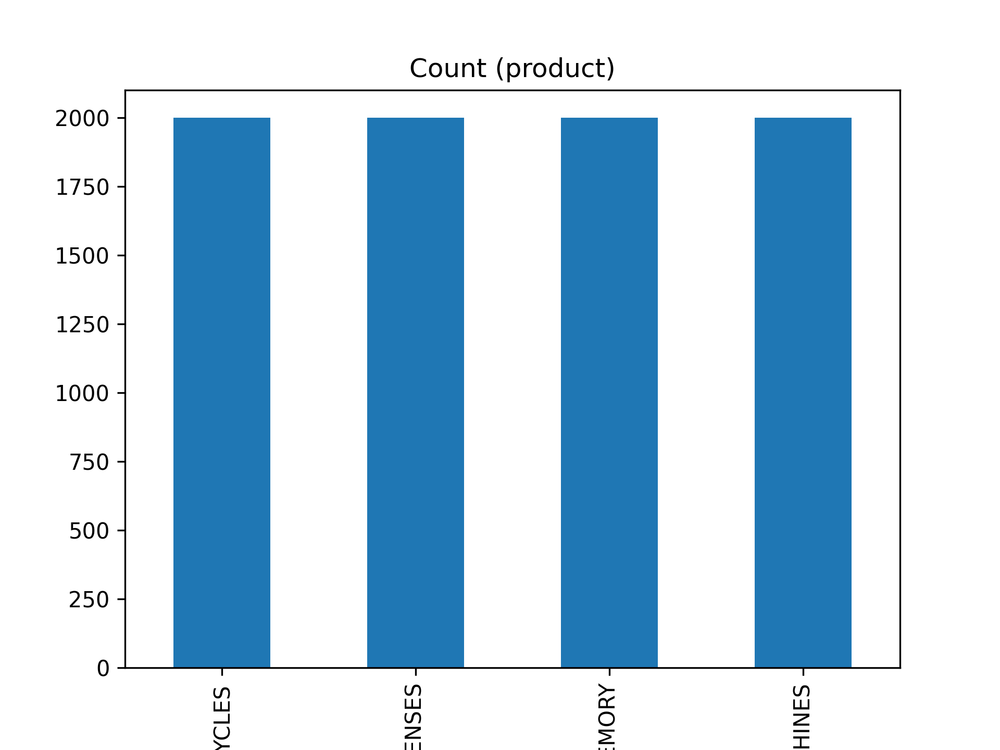
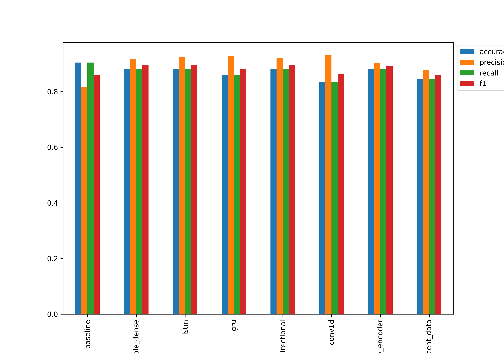
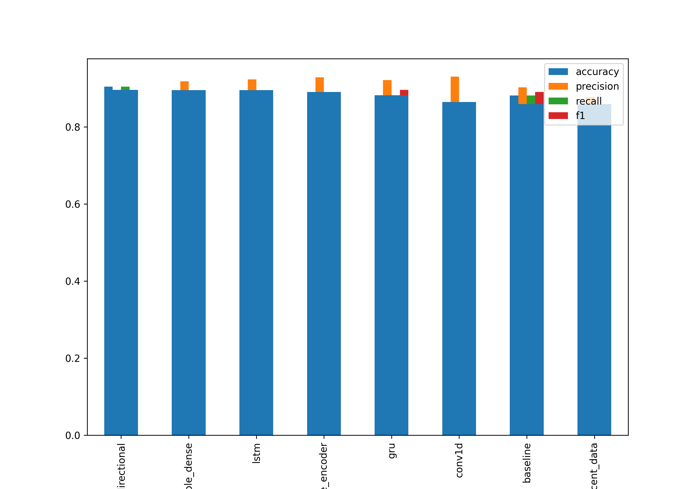

# Product Group	 API
***
#### Clone repository 
    
    git clone https://github.com/AndranikUgujyan/product_group_classification.git

#### Install and create virtual environment

    pip install virtualenv

    virtualenv venv

#### Activate a virtual environment

    source venv/bin/activate

#### Install required packages

    pip3 install -r requirements.txt
***
### Data:

We have balanced datasets.


To preprocess (normalize text) and split dataset into train/test run:
    
    python -m product_model.data_proc.processor

The command will generate normal sampled datasets and will save as a csv files inside data folder.

    python -m product_model.data_proc.embedding_processor

The command will generate embedded sampled datasets and will save as a csv files inside data folder.

[Embedding](https://huggingface.co/sentence-transformers/distiluse-base-multilingual-cased-v2) This is a sentence-transformers model: It maps sentences & paragraphs to a 512 dimensional dense vector space and can be used for tasks like clustering or semantic search.
***

## Models:

* Model 1: Multinomial Naive Bayes 
* Model 2: Logistic Regression
* Model 3: Random Forest Classifier
* Model 3: GRU model
* Model 4: K Neighbors Classifier
* Model 5: 1D Convolutional Neural Network
* Model 6: Random Forest Classifier (on embedded data)
* Model 7: SVC (on embedded data)
* Model 8: Logistic Regression (on embedded data)
* Model 9: K Neighbors Classifier (on embedded data)
* Model 10: Decision Tree Classifier (on embedded data)
* Model 10: Gradient Boosting Classifier (on embedded data)
***
### Model Train and Save

For train and save model based on normalized data run:

    python -m product.training.train

For train and save model based on embedded data run:

     python -m product.training.train_embedded

***
### Comparing the performance of each of models

Model's performances


Sorted model results by f1-score

***

## Run API
***
We have 2 option to run API:
1. without docker
2. inside docker
***
### Run API without docker

     python3 -m product_model.app

#### Test API without docker

    curl  -X POST -d '{"data":[{"main_text": "USB 3.0 OTG STICK 64GB","add_text":"ULTRA DUAL 18__USB STICKS", "manufacturer":"SANDISK","model":"kn" }]'  http://172.17.0.2:8080/identify_product -H "Content-Type:application/json"

***

### Run API inside docker docker

#### Build docker image

    docker build -t product-classification-api:1.0 -f Dockerfile .
    
#### Run docker

    docker run -e PORT=8080 --name imbd -p "7894:8080" product-classification-api:1.0
    
#### Test API in docker

    curl  -X POST -d '{"data":[{"main_text": "USB 3.0 OTG STICK 64GB","add_text":"ULTRA DUAL 18__USB STICKS", "manufacturer":"SANDISK","model":"kn" }]'  http://127.0.0.1:7894/identify_product -H "Content-Type:application/json"

***

**Here is an example response of `identify_product` prediction endpoint:**

```json
[
 "USB MEMORY"
]
```